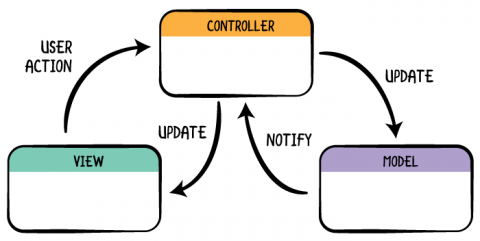
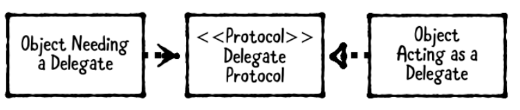
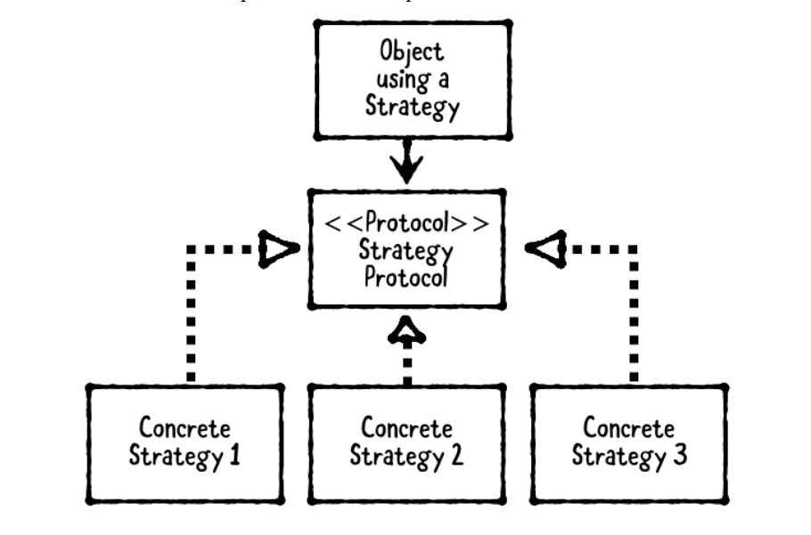
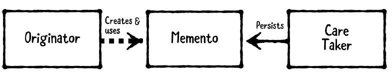
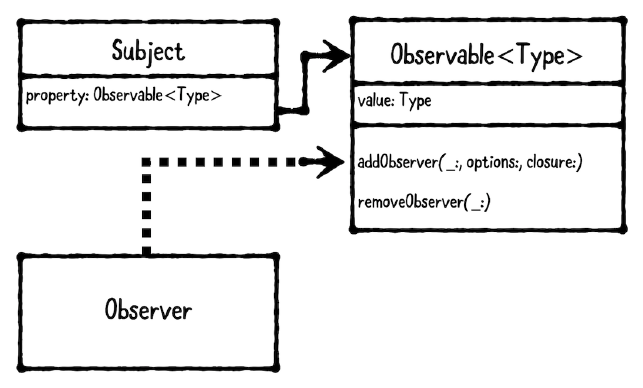
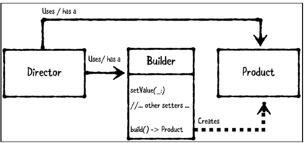

# There are three main types of design patterns:
1. Structural design pattern: Describes how objects are composed and combined to form larger structures. Examples of structural design patterns include Model-View-Controller (MVC), Model-View-ViewModel (MVVM) and Facade.
2. Behavioral design pattern: Describes how objects communicate with each other. Examples of behavioral design patterns are Delegation, Strategy and Observer.
3. Creational design pattern: Describes how to create or instantiate objects. Examples of creational patterns are Builder, Singleton and Prototype.

# Criticisms of design patterns As indicated
## - If you overuse design patterns, your project can become overly complex.
- You need to be careful about overusing any tool, including design patterns. You can minimize this issue by clearly and correctly defining the problem to be solved before adding a design pattern to your project.

## - Many design patterns are made redundant by modern programming languages.
- It’s true that modern programming languages like Swift make some design patterns irrelevant or trivial to implement. However, just because some patterns are provided via a programming language doesn’t mean all patterns will be.

## - Design patterns are a lazy substitute for learning object-oriented principles.
- Why not learn both? A strong understanding of object-oriented principles will certainly help you in your development. However, if you already know a design pattern works well for a particular problem, why should you reinvent the solution from scratch?

# Benefits of design patterns.
## Design patterns create a common language.
- Instead of describing a particular solution in detail, you can simply state which design pattern you think would work best. This streamlines communication between developers.

## Design patterns fast-track developer onboarding.
- It’s much easier to onboard a new developer on a project that uses design patterns, than on a project with completely custom logic.

## Design patterns make you a better person.
- Well, this one may still be up for debate. But some degree of self-improvement is never wasted! However, there is a grain of truth to this, as the next developer to maintain your project will certainly think you’re a better person for having left them a nice, designpattern- filled project instead of a spaghetti-coded mess!

## Knowing design patterns allow you to spot similarities between code.
- Once you know and understand different design patterns, you begin to notice their use in code. This gives you a leg up as you are at least a little familiar with how to use that code. For example, iOS and Mac programming makes heavy use of the Delegation pattern. You would spot this pattern easily if you ever moved to another platform that also uses Delegation and instantly be familiar with how the code is organized.

# How to Read a Class Diagram

## To indicate that one class inherits from another, use an open arrowhead:

But instead of reading this as “inherits from,” read this as “is a”. For example, to show
that SheepDog inherits from Dog, you’d draw the following diagram:

You would read this, from bottom to top, as “SheepDog is a Dog.”

## Use a plain arrowhead to indicate a property, which is known as an association in UML terms:

- Class diagrams can be written from bottom to top, from left to right, or in any other
orientation you’d like. Regardless of the orientation you choose, the direction of the
arrows define the meaning: Inheritance arrows always point at the superclass, and
property arrows always point at the property class.

- You should read a property arrow as “has a.” For example, if a Farmer has a Dog, you’d draw this:

- You can indicate one-to-many relationships by specifying a range next to the arrowhead. For example, you can denote a Farmer has one or more Dogs like this:

- You should always use the singular form of the class name in class diagrams, even if you’re conveying a one-to-many relationship. In this case, you should write Dog, not Dogs.
- You can use as many arrows and boxes as you need in a single class diagram. For example, here’s how you’d denote a Farmer has a SheepDog that’s a Dog:

## You also use a box to indicate a protocol. In order to distinguish it from a class, however, you need to write <<protocol>> before its name.

- Use an open arrowhead with a dashed line to indicate a class implements a protocol:

- You may either read this as “implements” or “conforms to.” For example, you’d indicate Farmer conforms to PetOwning like this: Use :

## Use a plain arrowhead with a dashed line to indicate “uses,” which is called a “dependency” in UML terms:

UML is intentionally vague about what a “dependency” is. Consequently, whenever you
use a dependency arrow, you usually should annotate its purpose. For example, you can
use a dependency arrow to indicate the following things:
• A weak property or delegate.
• An object that’s passed into a method as a parameter, but not held as a property.
• A loose coupling or callback, such as an IBAction from a view to a controller.
Here’s how you’d indicate that Dog delegates to a PetOwning object:

# [Model-View-Controller](./MVC.playground/Contents.swift)

# [Delegate Pattern](./DelegatePattern.playground/Contents.swift)

- **An object needing a delegate**, also known as the delegating object. It’s the object that has a delegate. The delegate is usually held as a weak property to avoid a retain cycle where the delegating object retains the delegate, which retains the delegating object.
- **A delegate protocol**, which defines the methods a delegate may or should implement.
- **A delegate**, which is the helper object that implements the delegate protocol.

# [Strategy Pattern](./StrategyPattern.playground/Contents.swift)

- The object using a strategy. This is most often a view controller when the pattern is used in iOS app development, but it can technically be any kind of object that needs interchangeable behavior.
- The strategy protocol defines methods that every strategy must implement.
- The strategies are objects that conform to the strategy protocol.

# [Singleton Pattern](./SingletonPattern.playground/Contents.swift)

- Use the singleton pattern when having more than one instance of a class would cause problems, or when it just wouldn’t be logical.
- Use the singleton plus pattern if a shared instance is useful most of the time, but you also want to allow custom instances to be created. An example of this is FileManager, which handles everything to do with filesystem access. There is a “default” instance which is a singleton, or you can create your own. You would usually create your own if you’re using it on a background thread.

# [Memento Pattern](./MementoPattern.playground/Contents.swift)

- The originator is the object to be saved or restored.
- The memento represents a stored state.
- The caretaker requests a save from the originator and receives a memento in response. The caretaker is responsible for persisting the memento and, later on, providing the memento back to the originator to restore the originator’s state.

# [Observer Pattern](./ObserverPattern.playground/Contents.swift)

1. The subject is the object that’s being observed.
2. The observer is the object doing the observing.

- Unfortunately, Swift 4 doesn’t yet have language-level support for KVO. Instead, you’re
required to import Foundation and subclass NSObject, which uses the Objective-C
runtime to implement KVO. What if you don’t want to, or can’t subclass NSObject? You
can write your own Observable wrapper class instead!
- You’ll get hands-on practice doing both the KVO and the Observable wrapper
implementations of the observer pattern in this chapter.

# [Builder Pattern](./BuilderPattern.playground/Contents.swift)

1. The director accepts inputs and coordinates with the builder. This is usually a view controller or a helper class that’s used by a view controller.
2. The product is the complex object to be created. This can be either a struct or a class, depending on desired reference semantics. It’s usually a model, but it can be any type depending on your use case.
3. The builder accepts step-by-step inputs and handles the creation of the product. This is often a class, so it can be reused by reference.

